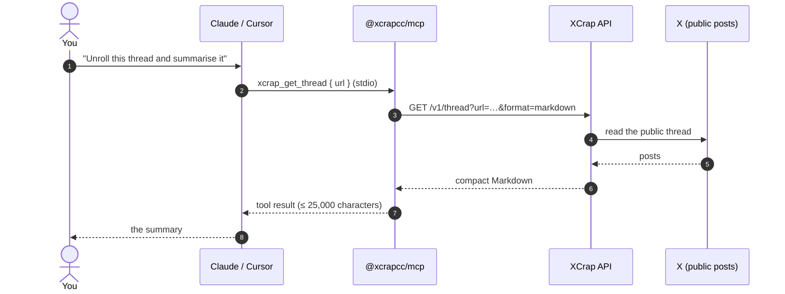
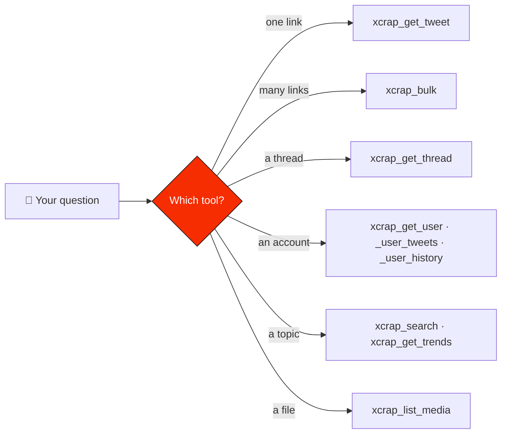

<p align="center">
  <a href="https://xcrap.cc"></a>
</p>

<p align="center">
  <a href="https://www.npmjs.com/package/@xcrapcc/mcp"></a>
  <a href="https://modelcontextprotocol.io"></a>
  
  <a href="https://xcrap.cc/docs"></a>
  
  <a href="https://github.com/XcrapCC/Xcrap-mcp/blob/main/LICENSE"></a>
  <a href="https://github.com/XcrapCC/Xcrap-mcp"></a>
</p>

<p align="center">
  <b>Twitter / X tools for LLM agents.</b><br>
  Search posts, read posts and their replies, unroll threads, extract profiles, timelines, account histories and follower lists, list media and check trends —<br>
  <b>without an X account, an API key, or a login.</b>
</p>

<p align="center">
  <a href="#claude-code">Claude Code</a> ·
  <a href="#claude-desktop">Claude Desktop</a> ·
  <a href="#cursor">Cursor</a> ·
  <a href="#tools">Tools</a> ·
  <a href="https://xcrap.cc/docs">API reference</a>
</p>

---

It wraps the public [XCrap](https://xcrap.cc) API. Twelve tools, one per endpoint, no credentials to configure. Use it hosted at `https://xcrap.cc/mcp` with nothing to install, or run it locally over stdio from npm — both serve the same tools.

> [!NOTE]
> **Always in step with the API.** Every time an XCrap endpoint is added or changed, this server is updated and released with it, so the tools always match what the API can do.

## Contents

- [How it works](#how-it-works)
- [Quick start](#quick-start) — [Claude Code](#claude-code) · [Claude Desktop](#claude-desktop) · [Cursor](#cursor) · [other clients](#any-other-mcp-client)
- [Tools](#tools)
- [Configuration](#configuration)
- [Design notes](#design-notes)
- [Rate limits](#rate-limits)
- [Development](#development)
- [Ethics and limits](#ethics-and-limits)
- [Related repositories](#related-repositories)

## How it works



## Quick start

### Hosted: nothing to install

Point any client that speaks Streamable HTTP at:

```
https://xcrap.cc/mcp
```

No key, no account, no session. In Claude Code:

```bash
claude mcp add --transport http xcrap https://xcrap.cc/mcp
```

In Cursor (`.cursor/mcp.json`):

```json
{
  "mcpServers": {
    "xcrap": { "url": "https://xcrap.cc/mcp" }
  }
}
```

In Claude Desktop or claude.ai, add it as a custom connector with that URL.

The hosted server is stateless and runs the same tools as the npm package. Each tool call is counted against your IP exactly like the API call it wraps (see [Rate limits](#rate-limits)).

### Local, over stdio

```bash
npx -y @xcrapcc/mcp
```

That is the whole installation. The server talks to `https://xcrap.cc`, and there is nothing to configure.

### Claude Code

```bash
claude mcp add xcrap -- npx -y @xcrapcc/mcp
```

Make it available in every project rather than just this one:

```bash
claude mcp add xcrap --scope user -- npx -y @xcrapcc/mcp
```

Then check it connected:

```bash
claude mcp list
```

### Claude Desktop

Edit `claude_desktop_config.json` and add the server:

| OS | Config file |
| --- | --- |
| 🍎 macOS | `~/Library/Application Support/Claude/claude_desktop_config.json` |
| 🪟 Windows | `%APPDATA%\Claude\claude_desktop_config.json` |
| 🐧 Linux | `~/.config/Claude/claude_desktop_config.json` |

```json
{
  "mcpServers": {
    "xcrap": {
      "command": "npx",
      "args": ["-y", "@xcrapcc/mcp"]
    }
  }
}
```

Restart Claude Desktop — fully quit it first (<kbd>Cmd</kbd> + <kbd>Q</kbd> on macOS). The tools appear under the connectors icon in the prompt box.

### Cursor

Create `.cursor/mcp.json` in the project (or `~/.cursor/mcp.json` for every project):

```json
{
  "mcpServers": {
    "xcrap": {
      "command": "npx",
      "args": ["-y", "@xcrapcc/mcp"]
    }
  }
}
```

Then enable **xcrap** in *Settings → Tools & Integrations → MCP*.

### Any other MCP client

Use `https://xcrap.cc/mcp` if the client speaks Streamable HTTP. Otherwise run `npx -y @xcrapcc/mcp`, or `node src/index.js` from a clone of this repository, over stdio.

## Tools

| | Tool | What it does |
| --- | --- | --- |
| 📄 | `xcrap_get_tweet` | One post by URL or id: text, author, timestamp, metrics, media, poll, quote, community note, and any notice X shows on it. `signals: true` adds facts about its reach (age, For You window, new-author slot, engagement ratios). A dead post says why: deleted, protected, suspended, withheld. |
| 🧵 | `xcrap_get_thread` | Unrolls a whole thread from any post in it, in order, author's posts only. |
| 👤 | `xcrap_get_user` | A public profile: bio, location, website, join date, verification, follower counts. |
| 📜 | `xcrap_get_user_tweets` | A page of an account's posts, newest first, cursor-paginated. |
| 🔎 | `xcrap_search` | Full-text search over X posts with X's own operators, latest, top, photos or videos. |
| 🗂️ | `xcrap_get_user_history` | Up to 200 of an account's posts in one call, optionally inside a date window, with `include_replies` and `include_reposts`. |
| 💬 | `xcrap_get_replies` | The replies to a post, most liked or newest first (one page, no paging). |
| 👥 | `xcrap_get_followers` | One page of the accounts following an account, as profiles, cursor-paginated. |
| ➡️ | `xcrap_get_following` | One page of the accounts an account follows, as profiles, cursor-paginated. |
| 🔥 | `xcrap_get_trends` | What is trending on X right now, with post volumes. |
| 🖼️ | `xcrap_list_media` | Every image, video and GIF on a post, with dimensions, alt text and direct download URLs. |
| 📦 | `xcrap_bulk` | Up to 50 posts in a single call — the right tool for a list of links. |

> [!IMPORTANT]
> Every tool is **read-only**. Nothing here posts, likes, follows, or modifies anything on X.

### Examples

Ask your client in plain language — it picks the tool:

| You ask | The agent calls |
| --- | --- |
| *"Unroll this thread and summarise the argument: https://x.com/jack/status/20"* | `xcrap_get_thread` |
| *"What has @NASA posted this week, images only?"* | `xcrap_get_user_tweets` with `media_only: true` |
| *"Get me the video from this post"* | `xcrap_list_media`, then hands over the `download_url` |
| *"Pull all 30 of these links into one summary"* | `xcrap_bulk` (one call, not thirty) |
| *"How many followers does @jack have?"* | `xcrap_get_user` |
| *"What are people on X saying about the Starship launch?"* | `xcrap_search` with `feed: "top"` |
| *"What are the replies saying about this post?"* | `xcrap_get_replies` |
| *"Everything @naval posted in March, reposts included"* | `xcrap_get_user_history` with `since`, `until` and `include_reposts: true` |



## Configuration

| Variable | Default | Purpose |
| --- | --- | --- |
| `XCRAP_BASE_URL` | `https://xcrap.cc` | API origin. Leave it unset; change it only to route requests through a proxy you control. |

> [!TIP]
> There is no API key. XCrap is free and unauthenticated, so the config blocks above are complete as they are.

## Design notes

<details open>
<summary><b>📝 Markdown by default, not JSON</b></summary>

Every tool that renders posts defaults to `format: "markdown"`, because a tool result is spent directly out of the model's context window and XCrap's Markdown rendering of a post is roughly a tenth the size of the same post as JSON — the JSON carries every null metric, every media variant and every entity offset, none of which a summarising model reads. Pass `format: "json"` when you genuinely need field-level access: numeric ids, media URLs, per-metric values. `xcrap_list_media` always returns JSON, because file URLs *are* field-level data.

</details>

<details>
<summary><b>✂️ Hard 25,000-character cap</b></summary>

No tool result can exceed it. When a response is cut, the model is told so explicitly, with the reason and the argument to change — a truncated answer that looks complete is worse than an error. Pagination cursors are lifted out before the cut so a truncated timeline can still be continued.

</details>

<details>
<summary><b>🧭 Errors are instructions, not status codes</b></summary>

| Status | What the model is told |
| --- | --- |
| `404` | The post is deleted, private, or never existed — *and retrying will not help*. |
| `429` | The retry-after window, and which endpoint budget was hit. |
| `451` | The account opted out of extraction and must not be worked around. |
| `502` | X could not be reached just now; usually transient. |

</details>

<details>
<summary><b>🕒 Freshness</b></summary>

XCrap caches posts for five days. Each result carries a one-line footer saying whether it came from the cache, so the model knows whether it is looking at live data.

</details>

## Rate limits

Per IP, per endpoint, enforced by the XCrap API. The same budgets apply whether you use the hosted server or the local one: a hosted tool call is counted exactly like the API call it wraps.

| Tool | Budget |
| --- | --- |
| `xcrap_get_tweet`, `xcrap_get_user` | 45 / minute |
| `xcrap_get_thread`, `xcrap_get_user_tweets` | 15 / minute |
| `xcrap_get_replies`, `xcrap_get_followers`, `xcrap_get_following` | 15 / minute |
| `xcrap_get_user_history` | 4 / 5 minutes |
| `xcrap_search` | 10 / 15 minutes |
| `xcrap_bulk` | 6 / 5 minutes (up to 50 posts each) |
| `xcrap_list_media` | 20 / minute |
| `xcrap_get_trends` | 90 / minute |

> [!TIP]
> Prefer one `xcrap_bulk` call over many `xcrap_get_tweet` calls: it is one request instead of N, and it runs them concurrently.

> [!IMPORTANT]
> **Running agents at scale?** The [Enterprise plan](https://xcrap.cc/enterprise) offers higher rate limits, dedicated capacity, custom endpoints and formats, priority support, and invoices or agreements — with the same rules (public accounts only). Write to **[hello@xcrap.cc](mailto:hello@xcrap.cc)**.

## Development

```bash
npm install
npm start                                              # run over stdio
npm run inspect                                        # MCP Inspector UI
npm run check                                          # syntax check
```

The tools are defined once, in `src/tools.js`. `src/index.js` runs them over stdio; the hosted server at `https://xcrap.cc/mcp` builds its server from the same file, so the two cannot drift.

<details>
<summary>Raw stdio round-trip, no client required</summary>

```bash
printf '%s\n' \
  '{"jsonrpc":"2.0","id":1,"method":"initialize","params":{"protocolVersion":"2025-06-18","capabilities":{},"clientInfo":{"name":"cli","version":"1.0.0"}}}' \
  '{"jsonrpc":"2.0","method":"notifications/initialized"}' \
  '{"jsonrpc":"2.0","id":2,"method":"tools/list","params":{}}' \
  | node src/index.js
```

</details>

Requires Node 20 or newer (built-in `fetch`, no HTTP dependency).

## Ethics and limits

| ✅ It does | 🚫 It will not |
| --- | --- |
| Read public posts, profiles, replies and follower lists | Read protected accounts, direct messages, or anything behind a login |
| Honour account opt-outs — a `451` is final | Route around an opt-out |
| Keep a short cache | Store anything beyond it |

## Related repositories

| Repository | What it is |
| --- | --- |
| 🟩 [**xcrap-node**](https://github.com/XcrapCC/xcrap-node) | The Node.js SDK — `npm install @xcrapcc/sdk` |
| 🐍 [**xcrap-python**](https://github.com/XcrapCC/xcrap-python) | The Python SDK — `pip install xcrap-sdk` |
| 📖 [**xcrap-docs**](https://github.com/XcrapCC/xcrap-docs) | Guides, API reference, OpenAPI 3.1, `llms.txt` and `skills.md` |
| 🏠 [**XcrapCC**](https://github.com/XcrapCC) | Everything XCrap on GitHub |

Agents that do not speak MCP can read [`skills.md`](https://xcrap.cc/skills.md), which teaches the whole API in one file, or [`llms.txt`](https://xcrap.cc/llms.txt).

---

<p align="center">
  <a href="https://xcrap.cc"><b>xcrap.cc</b></a> · <a href="https://xcrap.cc/docs">Docs</a> · <a href="https://modelcontextprotocol.io">Model Context Protocol</a><br>
  <sub>MIT licensed · Public data only · Not affiliated with X Corp.</sub>
</p>
